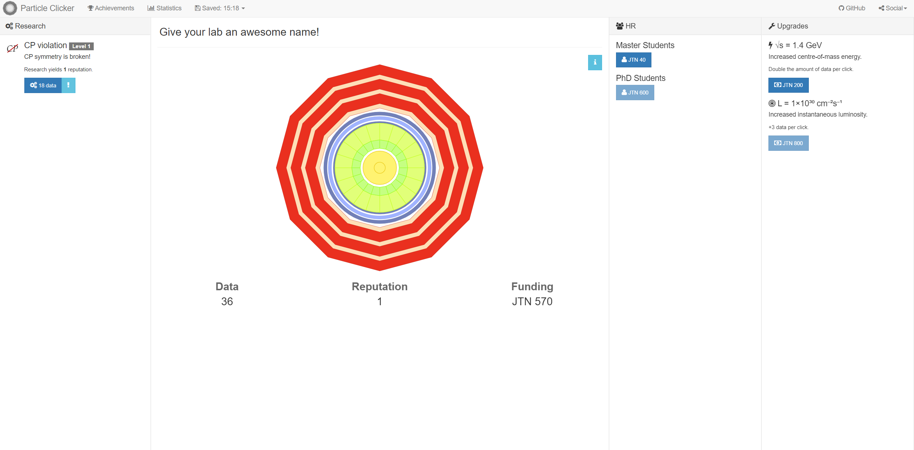

# Part 01: Ideation

Do you remember "[Cookie Clicker](https://orteil.dashnet.org/cookieclicker/)"? That game, and its copies, had a moment of popularity in 2013, while I was in college.

As a challenge to myself, I am going to create a silly "incrementer" game that copies the gameplay of "Cookie Clicker" in a new context, focusing on DevOps and "cloud native" development.

Personally, this is a chance for me to work on my frontend development skills and writing about development.

## What is Cookie Clicker?

The original game was produced by French web developer Julien Thiennot who goes by the handle "Orteil". It still has a following of several thousand. The original game itself has a great deal of depth that has been added over the years -- more than I can hope to accomplish within the scope of this project.

The main conceit of the game is that a user repeatedly clicks a button to "bake" cookies. The goal is to bake as many cookies as possible. The player can spend some of the cookies they have baked to purchase upgrades that will automatically bake cookies for the player. In this way, it is almost a play on the tower-defense game genre.

## Particle Clicker

There were many copies of the game produced at the height of its popularity. My favorite is "[Particle Clicker](http://particle-clicker.web.cern.ch/particle-clicker/)" developed by Tadej Novak and Kevin Dungs during the CERN Webfest in 2014. This copy was a big hit among my fellow Physics students when it came out and was actually how I was introduced to the original game.

In the same way that "Particle Clicker" takes the idea of "Cookie Clicker" into a Physics context, I am going to try and take the game into a DevOps context.

## Iteration Zero

### Goals

I have a single goal for the first iteration of the project:

- Deploy a silly web-based DevOps clicker game that can potentially entertain a player for ten minutes.

### Behaviors

Within the single goal, I have a bunch of behaviors I want to app to exhibit:

- Deploy a silly web-based DevOps clicker game that can potentially entertain a player for ten minutes.
  - It keeps score of "Devs"
  - It keeps score of "Ops"
  - It keeps score of "DevOps Points"
  - It keeps score of "DevOps Points" sold
  - It keeps score of net "DevOps Points"
  - It has a button to increment "Devs"
  - It has a button to increment "Ops"
  - It calculates "DevOps Points" from "Devs" and "Ops"
  - It has a timer (for calculating automatic points earning)
  - It can show notifications when events occur
  - It has a section for purchasing upgrades
  - It has a section for viewing upgrades
  - It allows a user to purchase upgrades
  - It executes upgrade functions at a regular cadence

### Wireframe

With these behaviors set, I created a wireframe of the app in Figma:

![Wireframe of iteration 0. On the left, a section labeled "Upgrades" has a upgrade labeled "Software Engineer" that costs 40 DevOps Points and automatically generates 10 devs every 10 seconds. On the right, a section labeled "Enhancements" has a single upgrade labeled "Software Engineer". The player has two of these. In the center, a readout shows a message about the game, a number - the players score - and two buttons, one with a label Dev and the other with a label Ops. At the top center of the wireframe, a card says "Notifications show up here.".](images/Iteration0Wireframe.png)

## Architecture

With these behaviors set, I can define a rough architecture to follow. I want to approach this as a state machine with each state having clear paths to others.
